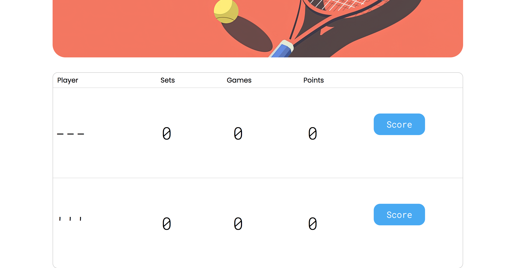
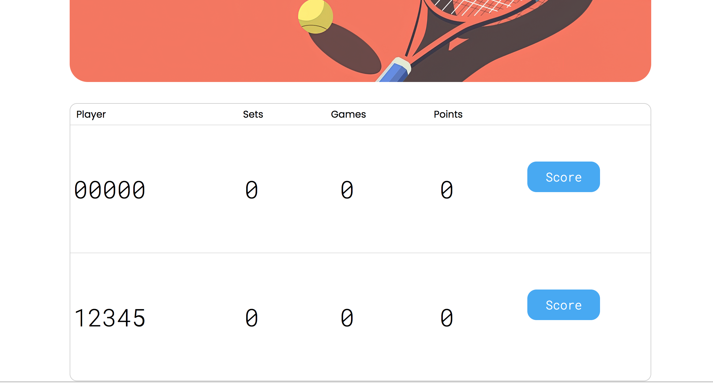
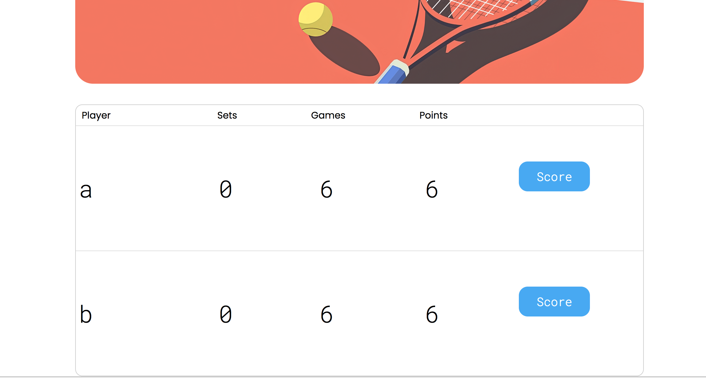
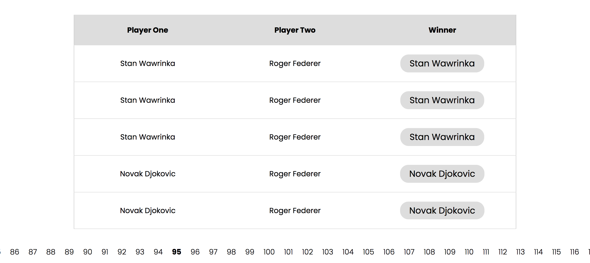

# Сводный отчёт по код-ревью проекта `tennis-scoreboard`

# Review на реализацию от [@X75473](https://github.com/XanderGI/TennisScoreboard) проекта [Табло теннисного матча](https://zhukovsd.github.io/java-backend-learning-course/projects/tennis-scoreboard/)

> Ревью выполнено в формате fork-а репозитория и добавления комментариев 'In-Situ' и обучающих заметок в формате markdown.

К классам и файлам конфигурации добавлены подробные комментарии. 

Там же есть ссылки на файлы, объясняющие некоторые особо значимые темы. 

Сами файлы с заметками находятся в одном пакете с классами, к которым относится тема заметки.

```
В `TODO`-комментариях️ описаны критически важные замечания, а также места нарушения ТЗ.
```

Список всех `TODO`-комментариев сгруппированных по пакетам и классам можно посмотреть в Idea через меню: `View` -> `Tool Windows` -> `TODO`

Читать стоит в таком порядке:

1. В файле `1-functional-overview.md` описан функциональный обзор приложения.

2. В файле `2-refactoring-roadmap.md` находится план работы над исправлениями.

- В файле `Pluses.md` описаны наиболее значимые плюсы. (можно читать в любое время)

- В файле `Maybe-usefull.md` собраны отсылки на некоторые темы и материалы, которые могут оказаться полезными в процессе рефакторинга. (можно читать в любое время)

- В файле `Conclusion.md` находится заключение. (можно читать в любое время)

```text
Знаком ❗️ помечены критически важные замечания, а также места нарушения ТЗ.
```

## Функциональный обзор

- Сейчас можно создать игроков с такими именами:





Раз в проекте есть валидация, стоит добавить проверку, что в имени есть буквы.

- ❗️Сейчас игрок выигрывает тай-брейк как только наберёт 7 очков




По ТЗ для победы в тай-брейке также должна учитываться минимальная разница в 2 очка.

- ❗️В пагинации на странице завершённых матчей отображаются все страницы, что плохо выглядит при большом количестве страниц и делает недоступными страницы за пределами экрана.



Лучше сделать отображение текущей и +-2 страниц вокруг неё.

## Конфигурационные файлы

### build.gradle.kts

Как и из кода, комментарии из файлов конфигурации лучше удалять
```kotlin
// Как и из кода, комментарии из файлов конфигурации лучше удалять
```
***

Вместо многочисленных вариантов зависимостей Lombok можно использовать io.freefair.lombok плагин
```kotlin
    compileOnly("org.projectlombok:lombok:1.18.42")
    annotationProcessor("org.projectlombok:lombok:1.18.42")
    annotationProcessor("org.projectlombok:lombok-mapstruct-binding:0.2.0")
```
***

## io.github.XanderGI

### Main

В веб-приложении класс Main с методом public static void main(String[] args) не является точкой входа в приложение, а также не выполняет никакой полезной работы, поэтому его нужно удалить
```java
public class Main {
    public static void main(String[] args) {
    }
}
```
***

## io.github.XanderGI.config

### AppConfig

Класс в текущем виде нарушает Принцип единственной ответственности (SRP) и имеет две разные ответственности:
- Хранение данных: он является неизменяемой структурой для хранения конфигурации (это его прямая задача как record)
- Загрузка данных: он выполняет роль статической фабрики и читает данные из переменных окружения
```java
public record AppConfig(
        String dbUrl,
        String dbUsername,
        String dbPassword,
        int cleanupPeriodMinutes,
        int staleMatchLifetimeMinutes
)
```
***

Нет обработки исключений при вызове Integer.parseInt()
```java
                Integer.parseInt(getEnvOrDefault("TENNIS_CLEANUP_PERIOD_MINUTES", "30")),
                Integer.parseInt(getEnvOrDefault("TENNIS_STALE_MATCH_LIFETIME_MINUTES", "60"))
```
***

## io.github.XanderGI.dto

### MatchDto

Можно сделать record
```java
public class MatchDto {

    private final String playerOneName;
    private final String playerTwoName;
    private final String winnerName;
}
```
***

### MatchScoreDto

Можно сделать record
```java
public class MatchScoreDto {

    private final PlayerItemDto playerOne;
    private final PlayerItemDto playerTwo;
    private final String winnerName;
    private final boolean isMatchOver;
}
```
***

isMatchOver можно удалить: если в матче есть победитель (winnerName != null), значит он завершён
```java
    private final boolean isMatchOver;
```
***

### MatchesPageDto

Можно сделать record
```java
public class MatchesPageDto {

    private final List<MatchDto> matches;
    private final int totalPages;
}
```
***

Можно добавить поля с номером страницы и фильтром по имени
```java
    private final List<MatchDto> matches;
    private final int totalPages;
```
***

### PlayerItemDto

Можно сделать record
```java
public class PlayerItemDto {

    private final Integer id;
    private final String name;
    private final String displayPoints;
    private final Integer games;
    private final Integer sets;
}
```
***

## io.github.XanderGI.entity

### Использование зарезервированных слов в качестве названий в БД

Использование зарезервированного слова (например, `USER`, `ORDER`, `GROUP`) в качестве названия таблицы в базе данных — это плохая практика, которая может привести к ряду проблем.

Вот основные из них:

### 1. Синтаксические ошибки

Это самая главная и частая проблема. SQL-парсер видит зарезервированное слово и ожидает определённой синтаксической конструкции, а не названия таблицы.

**Пример:**
При попытке получить все записи из таблицы с названием `ORDER`.
```sql
SELECT * FROM ORDER;
```
этот запрос, скорее всего, вызовет ошибку, потому что `ORDER` — это ключевое слово для `ORDER BY` (сортировка). Парсер будет ожидать после него `BY` и не поймёт, что `ORDER` — это название таблицы.

### 2. Необходимость экранирования (Quoting)

Чтобы обойти синтаксические ошибки, придётся постоянно заключать название таблицы в специальные кавычки, которые зависят от конкретной СУБД:

* **MySQL / MariaDB:** обратные кавычки (`` ` ``)
    ```sql
    SELECT * FROM `ORDER`;
    ```
* **PostgreSQL / Стандарт SQL:** двойные кавычки (`" "`)
    ```sql
    SELECT * FROM "ORDER";
    ```
* **SQL Server:** квадратные скобки (`[ ]`)
    ```sql
    SELECT * FROM [ORDER];
    ```

### 3. Снижение читаемости и усложнение кода

Из-за необходимости постоянного экранирования код становится менее читаемым. Разработчики могут легко забыть поставить кавычки, что приведёт к ошибкам, на поиск которых уйдёт время.

### 4. Проблемы с ORM и другими инструментами

Инструменты, которые автоматически генерируют SQL-запросы (например, Hibernate, JPA, SQLAlchemy и другие ORM), а также различные GUI-клиенты и утилиты для миграции, могут не справиться с такими названиями. Они могут не знать, что `ORDER` нужно экранировать, и будут генерировать нерабочий SQL-код. Это потребует дополнительной конфигурации или ручного вмешательства.

### 5. Потеря переносимости

Ключевые слова могут отличаться в разных СУБД. Слово, которое не зарезервировано в одной системе, может быть зарезервировано в другой. Если команда сменит СУБД, проект с такими названиями таблиц потребует значительной доработки.

---

**Лучшая практика:**

**Никогда не использовать зарезервированные слова для названий таблиц, столбцов и других объектов в БД.**

Всегда проверять список зарезервированных слов для основных СУБД. Чтобы избежать случайных совпадений, можно придерживаться соглашений об именовании, например:
* Использовать префиксы: `tbl_order`.
* Использовать множественное число (если слово во множественном числе не зарезервировано): `orders` (слово `orders` не зарезервировано).
* Добавлять суффиксы: `order_data`.

### Match

Такой конструктор не нужен, т.к. позволяет создать объект с установленным ID.
```java
@AllArgsConstructor
```
***

"Matches" является зарезервированным словом в некоторых СУБД. Здесь проблем не будет, но лучше не выбирать такие названия. (см. файл "sql-keywords.md" в этом же пакете)
```java
@Table(name = "Matches", check = {
        @CheckConstraint(name = "chk_matches_players_not_equal", constraint = "Player1 <> Player2"),
        @CheckConstraint(name = "chk_matches_valid_winner", constraint = "Winner = Player1 OR Winner = Player2")
})
```
***

Для корректного и безопасного создания новых, ещё не сохранённых в БД, матчей стоит создать и использовать конструктор со всеми полями, кроме ID.
```java
public class Match {
```
***

Связи `@ManyToOne` не имеют явного указания о стратегии загрузки. По умолчанию для `@ManyToOne` используется `FetchType.EAGER`, что приводит к немедленной загрузке связанных сущностей при загрузке `Match`. Это может вызывать проблемы производительности (N+1 запросов) и излишнюю загрузку данных, особенно если связанные объекты не всегда нужны.
```java
    @ManyToOne
    @JoinColumn(name = "Player1")
    private Player playerOne;
    @ManyToOne
    @JoinColumn(name = "Player2")
    private Player playerTwo;
    @ManyToOne
    @JoinColumn(name = "Winner")
    private Player winner;
```
***

Колонки игроков и победителя в `@JoinColumn` названы `Player1`, `Player2`, `Winner`. Для колонок, хранящих внешний ключ, уместно добавлять суффикс `_id`, чтобы было очевидно, что в них хранится идентификатор, а не какая-то другая информация. А также использовать более идиоматичный в SQL стиль lower_snake_case для названий колонок в БД.
```java
    @JoinColumn(name = "Player1")
    private Player playerOne;
    @JoinColumn(name = "Player2")
    private Player playerTwo;
    @JoinColumn(name = "Winner")
    private Player winner;
```
***

Для обязательных полей стоит добавить `optional = false` в `@ManyToOne` или `nullable = false` в `@JoinColumn` (можно добавить оба параметра). Целостность данных должна обеспечиваться на всех уровнях: в приложении (валидация) и в БД (constraints). Отсутствие ограничений в БД означает, что данные могут быть испорчены из-за ошибок в приложении или при прямом доступе к БД. А также можно добавить атрибут `updatable = false`. Это атрибут запрещает изменять колонку после её первоначальной вставки. Игроки матча и победитель не должны меняться, поэтому эти колонки можно защитить от обновлений.
```java
    @ManyToOne
    @JoinColumn(name = "Player1")
    private Player playerOne;
```
***

Если equals и hashCode не используются в проекте, их можно не переопределять.
```java
    @Override
    public boolean equals(Object obj) {
        if (this == obj) {
            return true;
        }

        if (!(obj instanceof Match match)) {
            return false;
        }

        return getId() != null && getId().equals(match.getId());
    }

    @Override
    public int hashCode() {
        return getClass().hashCode();
    }
```
***

Стоит добавить FetchType.LAZY, а также optional = false
```java
    @ManyToOne
    @JoinColumn(name = "Player1")
    private Player playerOne;
```
***

Можно добавить nullable = false и updatable = false
```java
    @JoinColumn(name = "Player1")
```
***

Стоит добавить FetchType.LAZY, а также optional = false
```java
    @ManyToOne
    @JoinColumn(name = "Player2")
    private Player playerTwo;
```
***

Можно добавить nullable = false и updatable = false
```java
    @JoinColumn(name = "Player2")
```
***

Стоит добавить FetchType.LAZY, а также optional = false
```java
    @ManyToOne
    @JoinColumn(name = "Winner")
    private Player winner;
```
***

Можно добавить nullable = false и updatable = false
```java
    @JoinColumn(name = "Winner")
```
***

### Player

Такой конструктор не нужен, т.к. позволяет создать объект с установленным ID.
```java
@AllArgsConstructor
```
***

можно задать индекс через аннотацию, чтобы у него было понятное имя — @Table(name = "Players", indexes = @Index(...)) или в файле миграции
```java
@Table(name = "Players")
```
***

Для корректного и безопасного создания новых, ещё не сохранённых в БД игроков, стоит создать и использовать конструктор со всеми полями, кроме ID.
```java
public class Player {
```
***

Сейчас ограничения на длину имени противоречивы:
- в классе Player — 255 (по умолчанию)
- в скрипте миграции — 255 (по умолчанию)
- в ValidationUtil — 50
Стоит привести их в согласованное состояние. Длина 50 выглядит разумной для этого проекта.
```java
    @Column(unique = true)
    private String name;
```
***

Стоит добавить length = 50 и nullable = false
```java
    @Column(unique = true)
```
***

## io.github.XanderGI.infrastructure.transaction

```text
Знаком ❗️ помечены критически важные замечания, а также места нарушения ТЗ.
```

### TransactionRunner

- ❗️В блоке `catch` вызов `transaction.rollback()` не обёрнут в `try-catch`.

Если во время отката транзакции произойдёт ещё одно исключение (например, из-за проблем с сетевым соединением с БД), это новое исключение "замаскирует" исходную ошибку, которая инициировала откат. В логах останется только ошибка отката, и разработчик не сможет узнать, что послужило первопричиной сбоя, что сильно усложняет отладку.

Стоит обернуть `transaction.rollback()` в собственный блок `try-catch` и, в случае ошибки, добавить новое исключение к исходному с помощью `originalException.addSuppressed(rollbackException)`.

<details>

<summary><b>💡 Например, так 💡</b></summary>

---

```java
private void safeRollback(Transaction transaction, Exception originalException) {
    if (transaction != null && transaction.isActive()) {
        try {
            transaction.rollback();
        } catch (Exception rollbackException) {
            originalException.addSuppressed(rollbackException);
        }
    }
}
```

</details>


### TransactionRunner

В блоке `catch` вызов `transaction.rollback()` не обёрнут в `try-catch`.
```java
        } catch (RuntimeException | Error e) {
            if (transaction != null && transaction.isActive()) {
                transaction.rollback();
            }

            throw e;
        }
```
***

## io.github.XanderGI.listener

### ContextListener

Для помещения объектов в контекст можно использовать "естественные константы" — `ClassName.class.getSimpleName()` или `ClassName.class.getName()`
```java
            sce.getServletContext().setAttribute(ONGOING_MATCHES_SERVICE, ongoingMatchesService);
            sce.getServletContext().setAttribute(FINISHED_MATCHES_SERVICE, finishedMatchesService);
            sce.getServletContext().setAttribute(MATCH_FACADE_SERVICE, matchFacadeService);
            sce.getServletContext().setAttribute(MATCH_MAPPER, matchMapper);
```
***

Можно использовать более мягкую процедуру остановки: сначала инициировать остановку с помощью `shutdown()`, потом дать время на завершение задач (через `awaitTermination()`) и только после этого вызывать `shutdownNow()`.
```java
            scheduler.shutdownNow();
```
***

## io.github.XanderGI.model

## "Типы моделей" в веб-приложении

| Тип | Назначение | Контекст |
|---|---|--- |
| Entity (Сущность) | Объекты, соответствующие таблицам базы данных, представляют данные в том виде, в котором они хранятся в базе данных| Уровень персистентности (JPA/Hibernate) |
| Domain Model (Доменная модель) | Программные абстракции, представляют бизнес-логику, правила и поведение предметной области| Бизнес-уровень приложения |
| DTO (Data Transfer Object) | Объекты, используемые для передачи данных между различными слоями приложения| Уровень представления, API |

### MatchScore

Класс хранит ссылки на JPA-сущности (`Player`). Использование объектов JPA Entity в доменной логике создаёт прямую зависимость доменного слоя от слоя персистентности (долговременного хранения данных) и смешивает слои приложения, что нарушает чистоту архитектуры. Это может привести к проблемам с ленивой загрузкой (`LazyInitializationException`) или к неожиданным изменениям в базе данных, если состояние `Player` будет изменено в ходе бизнес-логики. Доменные модели должны оперировать другими доменными моделями, а не сущностями, привязанными к базе данных.
```java
    private final Player playerOne;
    private final Player playerTwo;
```
***

Класс отвечает за обработку очков на всех этапах игрового процесса в матче — это слишком большая ответственность для одного класса и нарушает SRP (Single Responsibility Principle). Лучшим решением в этом направлении было бы, чтобы за счёт на каждом уровне (матч-сет-гейм) отвечал отдельный класс. Такой подход больше соответствовал бы ООП-стилю и принципу единственной ответственности для каждого класса.
```java
public class MatchScore {
```
***

Логика подсчёта очков не учитывает минимальную необходимую разницу в счёте для победы в тай-брейке
```java
    private final static int POINTS_TO_WIN_TIEBREAK = 7;
```
***

Блокировка в этом методе не нужна, так как внешняя блокировка (`synchronized (matchScore)`) в `MatchFacadeService` уже гарантирует, что только один поток может работать с этим объектом `matchScore`.
```java
    public synchronized void pointWonBy(Integer playerId) {
```
***

Попытка начислить очко в уже завершённом матче — это не нормальная ситуация и должна приводить к исключению, а не молчаливому бездействию.
```java
        if (isMatchOver()) {
            // Попытка начислить очко в уже завершённом матче — это не нормальная ситуация и должна приводить к исключению, а не молчаливому бездействию.
            return;
        }
```
***

### PlayerScore

Счёт в гейме, сете и матче не может быть null, поэтому лучше использовать примитивный тип `int`, вместо обёртки `Integer`
```java
    private Integer game;
    private Integer set;
    private Integer tieBreakPoint;
```
***

Этот класс не должен ничего знать о матче и том, как он начинается, поэтому лучше подобрать другое название. Создавать `PlayerScore` с нужными значениями — обязанность более верхнего уровня. Нет причин использовать в этом классе статический метод, вместо конструктора, который устанавливает значения по умолчанию.
```java
    public static PlayerScore matchStart() {
        return new PlayerScore(Point.ZERO, INITIAL_VALUE, INITIAL_VALUE, INITIAL_VALUE);
    }
```
***

Поскольку `point.prev()` бросает исключение на всех значениях, кроме AD, и нет метода для проверки, можно ли безопасно выполнить `point.prev()`, клиентский код будет вынужден использовать исключения для управления потоком выполнения, если по какой-то причине понадобится вызвать `decrementPoint` на объекте, где значение `point != ADVANTAGE`.
```java
    void decrementPoint() {
        point = point.prev();
    }
```
***

Возможно более понятным было бы название `reset*`
```java
    void clearPoints() {
        point = Point.ZERO;
    }
```
***

Возможно более понятным было бы название `reset*`
```java
    void clearGames() {
        game = INITIAL_VALUE;
    }
```
***

Возможно более понятным было бы название `reset*`
```java
    void clearTieBreakPoints() {
        tieBreakPoint = INITIAL_VALUE;
    }
```
***

### Point

Этот метод не должен знать о бизнес-правилах приложения (что после 40 и ниже нельзя вернуться обратно) — это обязанность клиентского кода
```java
    Point prev() {
        return switch (this) {
            case ZERO, FIFTEEN, THIRTY, FORTY ->
                    throw new IllegalStateException("The score of less than forty cannot decrease");
            case ADVANTAGE -> FORTY;
        };
    }
```
***

## io.github.XanderGI.repository

### MatchRepository

Передача доменной модели `MatchScore` в DAO нарушает Принцип разделения ответственности (Separation of Concerns) (см. файл "separation-of-concerns-principle.md" в этом же пакете).
```java
    void save(MatchScore matchScore);
```
***

### separation-of-concerns-principle.md

### Принцип разделения ответственности (Separation of Concerns) в архитектуре MVC(S)

## Введение

Любое программное приложение со временем усложняется. Чтобы сохранить возможность развивать и поддерживать его, в разработке используют принцип **разделения ответственности (Separation of Concerns, SoC)**. Суть его такая: каждый модуль или слой системы должен отвечать за одну чётко определённую задачу. Это улучшает читаемость кода, упрощает тестирование, позволяет заменять отдельные части без влияния на остальные.

## Общая архитектура MVC(S)

MVC (Model-View-Controller) – архитектурный паттерн для разделения данных приложения и управляющей логики на три отдельных компонента: модель, представление и контроллер. В веб-приложениях его часто расширяют до **MVC(S)**, где отдельно выделяют слой **Service** (бизнес-логика).

- **View (Представление)** – то, что видит пользователь (JSP-страницы).
- **Controller (Контроллер)** – сервлеты, которые принимают HTTP-запросы, вызывают нужные сервисы и передают данные в представление.
- **Model (Модель)** – данные и логика их обработки. В текущем проекте модель состоит из нескольких подуровней:
    - **Domain Model (Доменная модель)** – объекты, отражающие бизнес-сущности и правила.
    - **Service (Сервис)** – слой, содержащий бизнес-логику и координирующий работу с данными.
    - **DAO (Data Access Object)** – объекты доступа к данным, работающие с JPA-сущностями.
    - **JPA-Entity** – сущности, привязанные к таблицам базы данных через JPA-аннотации.
    - **DTO (Data Transfer Object)** – объекты для передачи данных между слоями (например, между сервисом и контроллером).

Такое расслоение позволяет чётко разграничить зоны ответственности каждого компонента.

## Детальный разбор слоёв

### 1. JSP (View)

JSP отвечает только за **отображение данных**, полученных от контроллера, и за формирование HTML-форм для отправки данных на сервер. JSP не должна содержать бизнес-логики, обращений к базе данных или прямых вызовов сервисов. Все необходимые для рендеринга данные контроллер помещает в атрибуты запроса (или сессии).

### 2. Сервлеты (Controller)

Сервлет выступает в роли **контроллера** – точки входа для HTTP-запросов. Его обязанности:
- Прочитать параметры запроса.
- Вызвать соответствующий метод сервиса (передав при необходимости DTO или простые параметры).
- Обработать результат: поместить данные в атрибуты запроса/сессии.
- Выбрать представление (JSP) для ответа и выполнить перенаправление или forward.

Контроллер **не должен содержать** бизнес-логику и код доступа к данным. Всё это делегируется сервисам.

### 3. DTO (Data Transfer Object)

DTO – это простые объекты, которые служат только для **передачи данных** между слоями приложения. Они не содержат бизнес-логики и обычно имеют только поля, конструкторы и геттеры/сеттеры.

Зачем нужны DTO, если есть доменные модели и JPA-сущности? Причины:
- **Изоляция представления от модели данных.** JSP может использовать только те поля, которые действительно нужны на странице, и не видеть, например, методы доменных объектов.
- **Упрощение сериализации.** Если понадобится отдавать данные в формате JSON, DTO удобно преобразовывать в JSON без риска зацикливания (при связях между сущностями).
- **Безопасность.** Нельзя случайно передать на клиент пароль или внутренние флаги.

### 4. Сервисы (Service)

Сервисный слой содержит **бизнес-логику приложения**. Здесь выполняются:
- Проверки правильности данных (валидация, которая не может быть выполнена на уровне БД).
- Координация нескольких DAO (например, перевод денег со счёта на счёт).
- Вычисления, формирование отчётов, отправка уведомлений.
- Преобразование доменных объектов в DTO (и обратно).

Сервис ничего не знает о том, как данные будут отображаться (JSP, REST и т.д.) и откуда пришёл запрос. Он работает с доменными моделями и DAO.

### 5. Доменные модели (Domain Model)

Доменная модель представляет **бизнес-сущности** и правила. В простейшем случае это могут быть POJO-классы, похожие на JPA-сущности, но с дополнительными бизнес-методами. В идеале доменная модель не зависит от способа хранения (БД) и содержит поведение.

### 6. JPA-Entity

Это класс, помеченный аннотациями JPA (@Entity, @Table и т.д.), который **отображается на таблицу базы данных**. Его поля соответствуют колонкам. Он может содержать аннотации связей (@OneToMany, @ManyToOne).

### 7. DAO (Data Access Object)

Слой DAO отвечает исключительно за **доступ к данным**. Он использует JPA EntityManager для выполнения CRUD-операций и запросов. DAO не должен содержать бизнес-логику. В простейшем случае методы: findById, findAll, save, update, delete.

## Принципы взаимодействия слоёв

Чтобы разделение ответственности работало, нужно строго соблюдать правила взаимодействия между слоями. Вот основные принципы:

1. **Контроллер** общается только с **сервисом**. Он передаёт ему данные из запроса (возможно, упакованные в DTO) и получает от сервиса DTO или простые типы.
2. **Сервис** работает с **DAO** и **доменными моделями**. Он может преобразовывать доменные объекты в DTO и обратно, но не должен знать о существовании HTTP-сессии или JSP.
3. **DAO** работает только с **JPA-сущностями** и EntityManager. Он не содержит бизнес-логики.
4. **JSP** использует только те данные, которые передал контроллер (атрибуты запроса). Никаких обращений к сервисам или DAO из JSP быть не должно.
5. **DTO** используются для передачи данных между **сервисом и контроллером** (или контроллером и представлением). Они не должны содержать ссылок на EntityManager или зависеть от JPA.

Такая изоляция позволяет менять реализацию любого слоя без влияния на другие. Например, можно заменить JSP на другой движок представлений (например, Thymeleaf), заменив только контроллер и добавив новые шаблоны. Или заменить Hibernate на другую реализацию JPA, изменив только DAO.

## Преимущества разделения ответственности

Когда каждый класс выполняет строго свою функцию, это даёт ряд преимуществ:

- **Лёгкость поддержки и модификации**. Если нужно изменить способ отображения (например, добавить пагинацию), меняется только JSP и, возможно, контроллер. Бизнес-логика остаётся нетронутой.
- **Тестируемость**. Сервисы можно тестировать с мок-объектами DAO без запуска сервера. DAO можно тестировать с in-memory БД (например, H2).
- **Возможность замены технологий**. Если нужно заменить JSP на Freemarker, понадобится новый контроллер (или модификация существующего), но сервисы и DAO не меняются. Чтобы перейти с Hibernate на EclipseLink меняется только JPA-провайдер и, возможно, настройки – код DAO остаётся тем же (если используется стандартный JPA API).
- **Командная разработка**. Разные разработчики могут параллельно работать над представлением, бизнес-логикой и доступом к данным, если чётко определены интерфейсы взаимодействия.

## Заключение

Разделение ответственности – фундаментальный принцип, который стоит применять даже в небольших проектах, чтобы избежать "каши" из кода и облегчить дальнейшее развитие.

Такой подход готовит почву для перехода на более мощные фреймворки (например, Spring), которые предлагают готовые механизмы для реализации этих слоёв (например, Spring MVC, Spring Data, Spring Web Services). Но даже без фреймворков, при следовании принципам SoC, получается чистый, понятный и гибкий код.

Главная цель разделения ответственности – упростить жизнь разработчикам и обеспечить долгосрочную жизнеспособность приложения.

## io.github.XanderGI.repository.impl

### HibernateMatchRepository

Название каждого именованного параметра тоже можно вынести в константу с понятным названием.
```java
public class HibernateMatchRepository implements MatchRepository {
```
***

Тело каждого метода стоит обернуть в try-catch и отлавливать HibernateException или PersistenceException. Слой DAO должен перехватывать специфичные для технологии исключения (например, `HibernateException`) и оборачивать их в свои, более общие исключения слоя доступа к данным (например, `DataAccessException`). Это скрывает детали реализации от верхних слоёв и делает их независимыми от деталей реализации DAO.
```java
public class HibernateMatchRepository implements MatchRepository {
```
***

Нарушение Принципа Инверсии Зависимостей (Dependency Inversion Principle). HibernateUtil (или SessionFactory) лучше принимать в конструктор в качестве аргумента, а не обращаться к статическим методам утилитного класса.
```java
public class HibernateMatchRepository implements MatchRepository {
```
***

В HQL запросе в методе `findMatches` используется `JoinType.INNER`. `INNER JOIN` вернёт только те записи о матчах, у которых все связанные сущности (`Player1`, `Player2`) гарантированно существуют в базе. Если по какой-либо причине (например, ошибка при импорте или ручное вмешательство) в таблице `Matches` окажется запись со значением `NULL` в колонке `Player1`, то такой матч будет молчаливо исключён из выборки. `LEFT JOIN` является более безопасным подходом:
- Он вернёт все матчи, даже если у них нарушена связь с игроком.
- Это позволит приложению либо упасть с `NullPointerException` (что явно укажет на проблему с целостностью данных), либо корректно обработать такую ситуацию, если она допустима. "Падать громко и рано" часто лучше, чем молча скрывать проблемы.
Стоит заменить `JoinType.INNER` на `JoinType.LEFT` для обоих игроков для большей устойчивости запроса к потенциально некорректным данным. (см. файл "join-fetch-left-join-fetch.md" в этом же пакете)
```java
public class HibernateMatchRepository implements MatchRepository {
```
***

Метод findMatches (и countMatchesByTokens) принимают List<String> tokens — список частей имён, по которым производится поиск. Возможно, идея была в том, чтобы реализовать поиск матчей сразу по нескольким именам, но из-за того, что условия собираются через 'AND' (criteria.where(criteriaBuilder.and(predicates))), поиск работает только если совпадают обе части имени (то есть в имени игрока есть каждый из токенов, а не один из них). То есть сейчас при фильтрации по строке "Andy Stan" приложение не найдёт ни один матч, так как игрока с именем, содержащим одновременно оба этих слова нет в БД. Чтобы это исправить надо использовать условие 'OR' (criteria.where(criteriaBuilder.or(predicates))) Тогда при фильтрации по строке "Andy Stan" приложение не найдёт все матчи, где в имени игрока встречается ИЛИ одно ИЛИ другое слово.
```java
public class HibernateMatchRepository implements MatchRepository {
```
***

С Criteria API можно использовать JPA Metamodel (зависимость hibernate-jpamodelgen), тогда вместо передачи именованных параметров: matchRoot.fetch("playerOne", JoinType.INNER); будет обращение к полям сгенерированного мета-класса: matchRoot.fetch(Match_.playerOne, JoinType.INNER);
```java
public class HibernateMatchRepository implements MatchRepository {
```
***

Передача доменной модели MatchScore в DAO нарушает Принцип разделения ответственности (Separation of Concerns) (см. файл "separation-of-concerns-principle.md" в пакете 'repository'). Слой DAO не должен ничего знать о доменных моделях и работать с ними. Преобразовывать доменные модели в JPA Entity — это задача сервисного слоя.
```java
    public void save(MatchScore matchScore) {
```
***

То, что пустой список означает "вернуть всё" — является негласным контрактом (хотя и понятным). Лучше иметь разные методы для выборки матчей с фильтром по имени и без него, чем собирать эту логику в одном методе. Если правила фильтрации поменяются, то нужно будет изменить/дописать только некоторые методы, оставив логику выборки без фильтра без изменений.
```java
    public List<Match> findMatches(int offset, int limit, List<String> tokens) {
```
***

Для поиска сразу по нескольким именам нужно использовать: criteria.where(criteriaBuilder.or(predicates));
```java
            criteria.where(criteriaBuilder.and(predicates));
```
***

То, что пустой список означает "посчитать всё" — является негласным контрактом (хотя и понятным). Лучше иметь разные методы для подсчёта количества матчей с фильтром по имени и без него, чем собирать эту логику в одном методе. Если правила фильтрации поменяются, то нужно будет изменить/дописать только некоторые методы, оставив логику выборки без фильтра без изменений.
```java
    public Long countMatchesByTokens(List<String> tokens) {
```
***

Для подсчёта сразу по нескольким именам нужно использовать: criteria.where(criteriaBuilder.or(predicates));
```java
            criteria.where(criteriaBuilder.and(predicates));
```
***

### HibernatePlayerRepository

Текст HQL запроса удобнее читать, когда он логично разбит на строки, даже если он короткий. Для визуального разделения запросов на строки лучше использовать текстовые блоки.
```java
public class HibernatePlayerRepository implements PlayerRepository {
```
***

Название именованного параметра тоже можно вынести в константу с понятным названием.
```java
public class HibernatePlayerRepository implements PlayerRepository {
```
***

Тело каждого метода стоит обернуть в try-catch и отлавливать HibernateException или PersistenceException. Слой DAO должен перехватывать специфичные для технологии исключения (например, `HibernateException`) и оборачивать их в свои, более общие исключения слоя доступа к данным (например, `DataAccessException`). Это скрывает детали реализации от верхних слоёв и делает их независимыми от деталей реализации DAO.
```java
public class HibernatePlayerRepository implements PlayerRepository {
```
***

Нарушение Принципа Инверсии Зависимостей (Dependency Inversion Principle). HibernateUtil (или SessionFactory) лучше принимать в конструктор в качестве аргумента, а не обращаться к статическим методам утилитного класса.
```java
public class HibernatePlayerRepository implements PlayerRepository {
```
***

Для единообразия кодовой базы в этом классе тоже можно использовать Criteria API (как в HibernateMatchRepository).
```java
public class HibernatePlayerRepository implements PlayerRepository {
```
***

Можно добавить суффикс '_QHL' или '_QUERY'.
```java
    private static final String FIND_BY_NAME = "FROM Player WHERE LOWER(name) = LOWER(:playerName)";
```
***

### InMemoryOngoingMatchRepository

Этот метод (и класс) не должен вычислять пороговое время удаления — лучше принимать его в качестве аргемунта.
```java
    public void removeStaleMatches(long expirationMinutes) {
```
***

Удаление внутри итерации по самой Map работает только потому, что используется ConcurrentHashMap. Если реализация хранилища по какой-то причине поменяется можно забыть внести изменения в этот метод и он упадёт с ConcurrentModificationException. Лучше использовать более безопасный и современный подход:
```java
        for (Map.Entry<UUID, MatchScore> entry : matches.entrySet()) {
```
***

### join-fetch-left-join-fetch.md

### JOIN FETCH и LEFT JOIN FETCH в JPA/Hibernate

#### 1. Что такое JOIN FETCH?

`JOIN FETCH` – это специальная конструкция в JPQL (Java Persistence Query Language), которая позволяет загрузить связанные сущности (ассоциации) в одном запросе с основной сущностью, избегая так называемой проблемы N+1 запроса. Обычно, если у сущности есть ленивая (LAZY) ассоциация, при обращении к ней Hibernate выполняет отдельный SQL-запрос для каждой такой сущности. Использование `JOIN FETCH` заставляет Hibernate выполнить SQL JOIN (объединение) и сразу получить все необходимые данные, заполнив ассоциацию в объекте.

Синтаксис:

```postgres-sql
SELECT e FROM Entity e JOIN FETCH e.association
```

Здесь `association` – это поле сущности, помеченное аннотациями `@OneToMany`, `@ManyToOne` и т.п.

#### 2. JOIN FETCH (INNER JOIN FETCH)

По умолчанию `JOIN FETCH` эквивалентен **INNER JOIN** в SQL. Это означает, что в результат попадут только те записи основной сущности, для которых существует связанная запись (по условию соединения). Сами связанные сущности будут загружены и инициализированы.

**Пример:**

Допустим, есть сущности `Order` (заказ) и `OrderItem` (позиция заказа). У заказа может быть много позиций. Чтобы получить все заказы, у которых **есть хотя бы одна позиция**, и сразу загрузить эти позиции, используем:

```postgres-sql
SELECT o FROM Order o JOIN FETCH o.items
```

Такой запрос вернет только заказы с позициями. Если у заказа нет позиций, он не будет включён в результат.

#### 3. LEFT JOIN FETCH

`LEFT JOIN FETCH` соответствует **LEFT OUTER JOIN** в SQL. Он возвращает все записи основной сущности, даже если для них нет связанных записей. Для тех, у кого связь отсутствует, ассоциация будет заполнена пустой коллекцией (или `null` для одиночных связей), но сама основная сущность попадёт в результат.

**Пример:**
```jpql
SELECT o FROM Order o LEFT JOIN FETCH o.items
```
Этот запрос вернёт **все** заказы, включая те, у которых нет позиций. Для заказов без позиций поле `items` будет пустым списком (если тип коллекции) или `null` (если это одиночная связь).

#### 4. Основные отличия

| Характеристика           | JOIN FETCH (INNER)                     | LEFT JOIN FETCH                        |
|--------------------------|----------------------------------------|----------------------------------------|
| Тип SQL JOIN             | INNER JOIN                             | LEFT OUTER JOIN                        |
| Включение сущностей без связи | Не включаются                        | Включаются, ассоциация пустая/null     |
| Результат запроса        | Только сущности, имеющие связанные     | Все сущности основной таблицы          |
| Использование            | Когда нужны только те, у кого есть связь | Когда нужны все, но с загрузкой связи  |

## io.github.XanderGI.service

### FinishedMatchesPersistenceService

Нет интерфейса для этого класса. (см. файл "service.md" в этом же пакете).
```java
public class FinishedMatchesPersistenceService {
```
***

Размер страницы по умолчанию более уместно хранить в сервлете, так как в идеале он должен приходить с фронтенда. А сервис должен принимать это значение в качестве аргумента в методы.
```java
    private static final int PAGE_SIZE = 5;
```
***

Можно добавить в маппер метод, который принимает список Entity и возвращает список DTO.
```java
                        List<MatchDto> matches = matchRepository.findMatches(offset, PAGE_SIZE, tokens).stream()
                                .map(mapper::toMatchDto)
                                .toList();
```
***

Лучше использовать примитивный тип long.
```java
                        Long countOfMatches = matchRepository.countMatchesByTokens(tokens);
```
***

Стоит ловить кастомные исключения, в которые заворачиваются иcключения, специфичные для DAO слоя (например, DataAccessException), а все остальные пропускать дальше к глобальному обработчику.
```java
        } catch (RuntimeException e) {
```
***

Стоит ловить кастомные исключения, в которые заворачиваются иcключения, специфичные для DAO слоя (например, DataAccessException), а все остальные пропускать дальше к глобальному обработчику.
```java
        } catch (RuntimeException e) {
```
***

Лучше принимать примитивный тип long, чтобы преобразование во время вычисления не могло выбросить NullPointerException.
```java
    private int calculateTotalPages(Long countOfMatches) {
```
***

### MatchFacadeService

Нет интерфейса для этого класса. (см. файл "service.md" в этом же пакете).
```java
public class MatchFacadeService {
```
***

Класс способствует смешению слоёв — передаёт доменную модель в слой контроллеров. (см. файл "separation-of-concerns-principle.md" в этом же пакете).
```java
public class MatchFacadeService {
```
***

Класс работает с объектами текущих матчей (MatchScore), поэтому его логику можно перенести в OngoingMatchesService.
```java
public class MatchFacadeService {
```
***

Неинформативное название метода.
```java
    public MatchScore playRally(UUID matchId, Integer playerId) {
```
***

Метод не должен возвращать доменную модель.
```java
    public MatchScore playRally(UUID matchId, Integer playerId) {
```
***

### MatchScoreCalculationService

Класс не добавляет никакой дополнительной логики к запуску начисления очка и служит простой обёрткой над вызовом метода модели. В текущем виде он является избыточным слоем абстракции, который усложняет код, не принося никакой пользы.
```java
public class MatchScoreCalculationService {
```
***

### OngoingMatchesService

Нет интерфейса для этого класса. (см. файл "service.md" в этом же пакете).
```java
public class OngoingMatchesService {
```
***

Класс отвечает за создание объекта текущего матча (доменной модели). При этом он способствует смешению слоёв — передаёт JPA Entity в доменную модель. (см. файл "separation-of-concerns-principle.md" в этом же пакете).
```java
public class OngoingMatchesService {
```
***

Этот метод должен выполняться в транзакции.
```java
    public UUID create(String nameOne, String nameTwo) {
```
***

Можно вынести этот if во вспомогательный метод, а также проверять совпадение имён после .trim(), чтобы имена "Петя" и "Петя  " считались одинаковыми.
```java
        if (nameOne.equalsIgnoreCase(nameTwo)) {
```
***

Не нужно передавать JPA Entity в доменные модели.
```java
        MatchScore matchScore = new MatchScore(
                playerOne,
                playerTwo,
                PlayerScore.matchStart(),
                PlayerScore.matchStart()
        );
```
***

### PlayerService

Нет интерфейса для этого класса. (см. файл "service.md" в этом же пакете).
```java
public class PlayerService {
```
***

Транзакция должна оборачивать всю бизнес-операцию создания матча (то есть метод create в OngoingMatchesService).
```java
    public Player getOrCreatePlayer(String name) {
```
***

Стоит ловить кастомные исключения, в которые заворачиваются иcключения, специфичные для DAO слоя (например, DataAccessException), а все остальные пропускать дальше к глобальному обработчику.
```java
        } catch (RuntimeException e) {
```
***

ConstraintViolationException не всегда означает нарушение уникальности имени.
```java
            if (isConstraintViolation(e)) {
```
***

Просто поиск игрока можно выполнять без транзакции.
```java
                return transactionRunner.execute(() -> playerRepository.findByName(name))
```
***

### separation-of-concerns-principle.md

*(Содержимое идентично файлу в пакете repository, вставлено целиком)*

### service.md

```text
Знаком ❗️ помечены критически важные замечания, а также места нарушения ТЗ.
```

## service

- ❗️В пакете отсутствуют интерфейсы для сервисных классов. Все классы являются конкретными реализациями, от которых напрямую зависят другие компоненты приложения (например, сервлеты).

Почему это проблема:

  - Нарушение Принципа инверсии зависимостей (Dependency Inversion Principle): Принцип гласит, что модули верхних уровней не должны зависеть от модулей нижних уровней, а также они должны зависеть от абстракций. В данном случае вышестоящие модули (сервлеты) напрямую зависят от конкретных реализаций сервисов, что делает систему жёстко связанной и хрупкой.

  - Низкая тестируемость: Невозможно провести полноценное модульное тестирование компонентов, которые зависят от этих сервисов. Например, чтобы протестировать сервлет, использующий `FinishedMatchesPersistenceService`, необходимо создавать полный экземпляр этого сервиса со всеми его реальными зависимостями, что превращает модульный тест в сложный интеграционный.

  - Низкая гибкость и невозможность расширения: Если потребуется создать альтернативную реализацию какого-либо сервиса, это потребует изменения кода во всех местах, где использовалась оригинальная реализация.

  - В классе-реализации публичные методы смешиваются с его внутренними или вспомогательными методами. Интерфейс же служит чётким, явным контрактом, который показывает, что сервис предоставляет внешнему миру, скрывая детали его внутренней работы.

Для каждого класса в этом пакете стоит создать интерфейс, который будет определять его публичный контракт, и изменить все зависимые классы так, чтобы они использовали этот интерфейс.

## io.github.XanderGI.servlet

### BaseServlet

Сервлет отправляет сообщение из исключения (`e.getMessage()`) напрямую пользователю. Сообщения об ошибках из исключений могут содержать технические детали, которые не предназначены для конечного пользователя и могут представлять угрозу безопасности. Например, сообщение может быть `"No entity found for query 'SELECT ...'"` или `"Validation failed for field 'internalFieldName'"`, что раскрывает структуру БД или внутренние имена полей. Лучше никогда не отправлять необработанное сообщение из исключения на клиент. Вместо этого можно использовать заранее определённые, безопасные сообщения или коды ошибок. Само исключение при этом нужно логировать для разработчиков. Это повысит безопасность приложения и улучшит пользовательский опыт при возникновении ошибок. В этом проекте допустимо сделать это для ошибок валидации.
```java
public abstract class BaseServlet extends HttpServlet {
```
***

Не стоит отправлять сообщение из исключения (e.getMessage()) напрямую во View.
```java
            handleError(req, resp, VIEW_SERVER_ERROR, e.getMessage(), HttpServletResponse.SC_INTERNAL_SERVER_ERROR);
```
***

### MatchScoreServlet

Все повторяющиеся или важные строковые литералы лучше выносить в `private static final` константы с понятными именами. Именованная константа делает код более семантически понятным.
```java
public class MatchScoreServlet extends BaseServlet {
```
***

Сервлет работает с доменной моделью `MatchScore`. Это нарушает границы между слоями приложения и Принцип разделения ответственности (см. файл "separation-of-concerns-principle.md" в этом же пакете). Сервлет не должен работать с доменными моделями. Вместо этого он должен "общаться" с другими слоями через DTO.
```java
public class MatchScoreServlet extends BaseServlet {
```
***

Сервлет берёт на себя лишнюю ответственность — преобразует доменные модели в DTO, хотя его задача — только принимать HTTP-запросы и делегировать их обработку. Это нарушает принцип единственной ответственности (SRP) и делает код сервлета более сложным и трудным для тестирования. Сервлет должен быть "тонким контроллером", делегирующим всю бизнес-логику одному фасадному сервису. (см. файл "fat-controller.md" в этом же пакете).
```java
public class MatchScoreServlet extends BaseServlet {
```
***

Для получения объектов из контекста можно использовать "естественные константы" — ClassName.class.getSimpleName() или ClassName.class.getName().
```java
        ongoingMatchesService = (OngoingMatchesService) getServletContext().getAttribute(ContextListener.ONGOING_MATCHES_SERVICE);
```
***

Сервлет не должен работать с доменными моделями и заниматься преобразованием в DTO.
```java
        MatchScoreDto dto = ongoingMatchesService.get(matchId)
                .map(mapper::toMatchScoreDto)
                .orElseThrow(() -> new MatchNotFoundException("Match not found"));
```
***

Сервлет не должен работать с доменными моделями.
```java
        MatchScore matchScore = matchFacadeService.playRally(matchId, playerId);
```
***

Сервлет не должен заниматься преобразованием в DTO.
```java
            MatchScoreDto dto = mapper.toMatchScoreDto(matchScore);
```
***

### MatchesServlet

Все повторяющиеся или важные строковые литералы лучше выносить в `private static final` константы с понятными именами. Именованная константа делает код более семантически понятным.
```java
public class MatchesServlet extends BaseServlet {
```
***

Для получения объектов из контекста можно использовать "естественные константы" — ClassName.class.getSimpleName() или ClassName.class.getName().
```java
        finishedMatchesService = (FinishedMatchesPersistenceService) getServletContext().getAttribute(ContextListener.FINISHED_MATCHES_SERVICE);
```
***

Можно добавить pageNumber и filterName в DTO и передавать все необходимые для JSP параметры в одном объекте.
```java
        req.setAttribute("dto", dto);
```
***

### NewMatchServlet

Все повторяющиеся или важные строковые литералы лучше выносить в `private static final` константы с понятными именами. Именованная константа делает код более семантически понятным.
```java
public class NewMatchServlet extends BaseServlet {
```
***

Для получения объектов из контекста можно использовать "естественные константы" — ClassName.class.getSimpleName() или ClassName.class.getName().
```java
        ongoingMatchesService = (OngoingMatchesService) getServletContext().getAttribute(ContextListener.ONGOING_MATCHES_SERVICE);
```
***

### fat-controller.md

### Архитектурный анти-паттерн: "Толстый контроллер" (Fat Controller)

"Толстый контроллер" — это распространенный анти-паттерн в приложениях, построенных на архитектуре MVC (Model-View-Controller). Он возникает, когда слой контроллеров берет на себя слишком много ответственности. Вместо того чтобы быть тонким связующим звеном, он разрастается и вбирает в себя логику, которая должна находиться в других слоях приложения.

#### Как должно быть

В идеальной архитектуре **"Худые контроллеры, толстые модели" (Thin Controllers, Fat Models)**, обязанности строго разделены:

| Слой  | Обязанности |
|:---|:---|
| **Худой Контроллер** (Thin Controller) | - Принять HTTP-запрос и разобрать его параметры.<br>- Вызвать **один** метод в сервисном слое (модели), передав ему эти данные.<br>- Получить от сервиса результат. <br>- Выбрать подходящее представление (View) и передать ему результат для отображения. |
| **Толстая Модель (Сервисный слой)** (Fat Model) | - Бизнес-логика: Сложные вычисления, принятие решений, изменение состояния бизнес-сущностей.<br>- Логика доступа к данным: Прямые запросы к базе данных (например, через DAO или EntityManager).<br>- Оркестрация: Координация работы нескольких сервисов для выполнения одной бизнес-операции.<br>- Управление транзакциями.|

При таком подходе бизнес-логика становится независимой от веб-слоя, легко тестируется и может быть переиспользована где угодно.

"Толстый контроллер" нарушает это разделение. Он начинает содержать в себе бизнес-логику, логику доступа к данным, оркестрацию нескольких сервисов и даже форматирование данных.

#### Последствия "Толстого контроллера"

1. Нарушение Принципа единственной ответственности (SRP): Контроллер начинает делать всё сразу, что делает код запутанным и сложным для понимания.

2. **Низкая тестируемость:** Бизнес-логику внутри контроллера практически невозможно протестировать в изоляции от веб-контекста.

3. **Плохая переиспользуемость:** Логика, "запертая" в контроллере, не может быть повторно использована в других частях системы (например, в фоновых задачах или для мобильного API).

4. **Дублирование кода (нарушение DRY):** Если похожая бизнес-операция понадобится в другом контроллере, высока вероятность, что разработчик просто скопирует кусок кода, вместо того чтобы вынести его в общий сервис.

5. **Сложность в поддержке:** Код становится запутанным, а его обязанности — размытыми, что усложняет отладку и внесение изменений.

#### Решение

Решение заключается в рефакторинге: необходимо переносить всю бизнес-логику и логику оркестрации из контроллеров в соответствующий **сервисный слой**. Контроллер должен оставаться "худым" — его единственная задача быть посредником между миром HTTP и приложением.

### separation-of-concerns-principle.md

*(Содержимое идентично файлу в пакете repository, вставлено целиком)*

## io.github.XanderGI.util

### HibernateUtil

Класс спроектирован как утилитный, но при этом не объявлен как final.
```java
public class HibernateUtil {
```
***

Класс является реализацией антипаттерна Service Locator. Это затрудняет тестирование и создаёт неявные зависимости в коде. Лучше перейти на внедрение зависимостей (Dependency Injection), где экземпляр SessionFactory создаётся один раз и передаётся в конструкторы зависимых компонентов.
```java
public class HibernateUtil {
```
***

### SearchUtil

Класс спроектирован как утилитный, но при этом не объявлен как final.
```java
public class SearchUtil {
```
***

### ValidationUtil

Класс спроектирован как утилитный, но при этом не объявлен как final.
```java
public class ValidationUtil {
```
***

Методы валидируют и парсят значения — это нарушает Принцип единой ответственности (SRP). Валидатор должен заниматься только валидацией.
```java
public class ValidationUtil {
```
***

Более точным было бы сообщение "Player name can only contain latin letters, numbers, spaces, hyphens, and apostrophes."
```java
            throw new InvalidMatchException("The name of the players must contain only the latin alphabet");
```
***

## Тесты

### MatchScoreTest

После проведения декомпозиции и рефакторинга доменных моделей, также следует изменить тесты для этой части логики.
```java
class MatchScoreTest {
```
***

Тестирование основной бизнес-логики должно быть возможным без классов JPA Entity.
```java
class MatchScoreTest {
```
***

Тесты не находят баг в логике тай-брейка.
```java
class MatchScoreTest {
```
***

### MatchScoreCalculationServiceTest

Класс MatchScoreCalculationService не содержит никакой логики — для него не нужен тест.
```java
public class MatchScoreCalculationServiceTest {
```
***

## Представления (JSP)

### match-score.jsp

Если текст внутри двойных кавычек нужно заключить ещё в одни кавычки — стоит использовать одинарные, иначе первая двойная кавычка считается закрывающей. Сейчас так: `<input type="hidden" name="playerId" value="<c:out value="${match.playerOne.id}"/>">` Лучше так: `<input type="hidden" name="playerId" value="<c:out value='${match.playerOne.id}'/>">`
```html
<input type="hidden" name="playerId" value="<c:out value="${match.playerOne.id}"/>">
```
***

Если текст внутри двойных кавычек нужно заключить ещё в одни кавычки — стоит использовать одинарные, иначе первая двойная кавычка считается закрывающей. Сейчас так: `<input type="hidden" name="playerId" value="<c:out value="${match.playerTwo.id}"/>">` Лучше так: `<input type="hidden" name="playerId" value="<c:out value='${match.playerTwo.id}'/>">`
```html
<input type="hidden" name="playerId" value="<c:out value="${match.playerTwo.id}"/>">
```
***

### matches.jsp

Цикл от 1 до totalPages отображает сразу все существующие страницы. Лучше сделать окно пагинации ограниченным текущей страницей +-2 вокруг неё.
```html
<c:forEach var="i" begin="1" end="${dto.totalPages}">
```
***

Если текст внутри двойных кавычек нужно заключить ещё в одни кавычки — стоит использовать одинарные, иначе первая двойная кавычка считается закрывающей. Сейчас так: `<a class="prev" href="<c:out value="${prevPageUrl}"/>"> < </a>` Лучше так: `<a class="prev" href="<c:out value='${prevPageUrl}'/>"> < </a>` Аналогично и в других местах.
```html
<a class="prev" href="<c:out value="${prevPageUrl}"/>"> < </a>
```
***

## Может быть полезным

- Посмотреть записи стримов по декомпозиции в ООП (наиболее полезным для этого проекта может оказаться стрим по игре Орёл и решка)

- Изучить паттерн Chain of responsibility

- Посмотреть, что такое Hibernate Validator

## Плюсы

- Имена классов, методов и переменных понятны и отражают их назначение
- Логичное разделение классов проекта по пакетам
- Есть разделение на слои (Servlet -> Service -> Repository)
- Реализованы специализированные классы исключений
- Использование DTO
- Используются транзакции (+ специальный вспомогательный класс)
- Управление транзакциями не находится в слое DAO
- Объекты всех ключевых классов создаются только по одному разу
- Используется ConcurrentHashMap для хранения текущих матчей
- Есть тесты
- Реализован валидатор
- Работает фильтрация матчей по имени игрока
- Работает пагинация на странице поиска матчей (хоть и стоит её доработать)
- Используется Lombok для уменьшения boilerplate-кода
- БД наполняется тестовыми данными при старте приложения
- Используются миграции
- Страницы JSP лежат внутри `/WEB-INF`
- Есть отдельная JSP страница для ошибок
- Есть логирование
- Есть README
- Успешный деплой приложения

## Заключение

Аккуратная и уверенная реализация проекта. Чувствуется желание взять от учебного проекта максимум — что является правильным подходом на пути профессионального становления.

Рефакторинг по описанным замечаниям станет интересной практикой и поможет ещё усилить навыки разработки.
